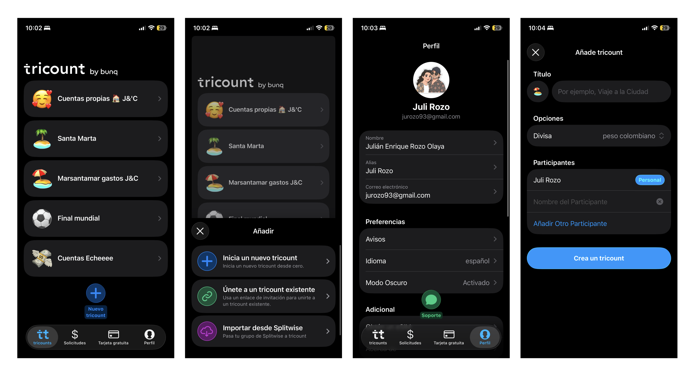
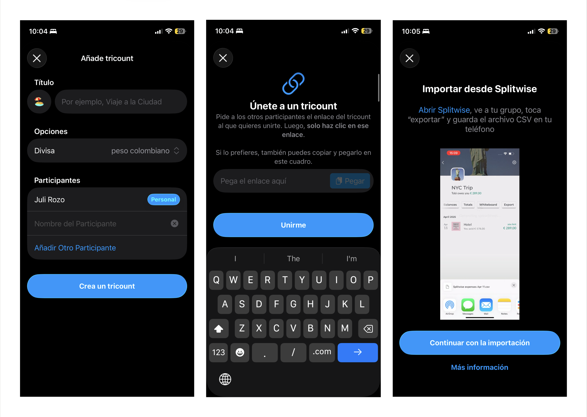

# Benchmark — Tricount

**App analizada:** Tricount · **Analista:** Julián · **Fecha:** 2026-09-01

> Tricount es conocida por ser la más simple del grupo. Su apuesta: reducir opciones para reducir fricción. El objetivo de este análisis es identificar exactamente dónde traza ese límite y qué sacrifica al hacerlo.

* Bélgica en 2010 como proyecto paralelo de Guillebert de Dorlodot y Jonathan Fallon.
* En mayo de 2022 fue adquirida por el neobanco bunq, y hoy corre sobre su infraestructura.
* En 2025 sus usuarios repartieron globalmente £20.2 mil millones en gastos compartidos.
  
---

## Impresión general

**¿Cuál es la promesa central de la app? ¿Cómo se presenta a sí misma?**

> La promesa central es ==**hacer extremadamente fácil y sin fricción dividir y seguir gastos compartidos entre personas**== (amigos, pareja, roomies, viaje, etc.), evitando conflictos y conversaciones incómodas sobre dinero.

Se presenta a sí misma como **==“la forma más fácil de dividir los gastos entre amigos”==**

> ==***"¿De viaje, compartiendo piso o saliendo con tus amigos? tricount te ayuda a llevar la cuenta de quién pagó qué. ¡100% gratis!***"

#### Uso cotidiano

Viajar, compartir piso, salir con amigos. En ese contexto, propone una solución sencilla:

1. Invitas a tus amigos
2. Añades los gastos
3. "Te centras en disfrutar”  *(La app se ocupa de la parte incómoda del dinero para que las personas se enfoquen en sus vivencias y experiencias)*

> Se posiciona como una app **==confiable==** **(4,8 App Store)** y **==masiva==** (21MM de usuarios)

**Primera reacción al abrir la app por primera vez:**

* Muy fácil de utilizar
* Simple y Minimalista (funcionalidad y look & feel)
* Divertida

**A nivel funcional**

* Registra quién ha pagado qué
* Sincronización de valores y estados 
* Permite que todos añadan gastos y vean el detalle
* Automatiza parte del proceso si conectas la tarjeta bunq
* Calcula quién debe con criterios flexibles (partes iguales, porcentajes, cantidades), ofreciendo también sugerencias “justas, simples e inteligentes” para saldar cuentas.

---

## A — Onboarding & tiempo hasta primer valor

*¿Qué tan rápido llega el usuario a entender y usar la app sin instrucciones?*

---

**1. ¿Qué solicita la app antes de permitir crear un grupo? (cuenta, email, Google, sin registro)**

==Ofrece 3 formas para poder abrir un "tricount":==

1. Nuevo tricount: Inicia un nuevo tricount desde ceros
	* Título del tricount: ej. Viaje a la ciudad
	* **Opciones:**
		* Divisas (ARS, COP, CLP, USD)
	* **Participantes:** 
		* El creador (Personal)
		* Nombre de otro participante
	  
2. Unete a un tricount: Usa un enlace de invitación para unirte a u tricount existente.
3. Importa desde splitwise: Pasa tu grupo de splitwise a tricount

**2. ¿Cuántos pasos hay desde abrir la app hasta ver un saldo calculado por primera vez?**

Al menos 11 pasos:

1. ==**On tap: Botón/"Nuevo tricount"==**
2. On screen from bottom: Modal → Elegir opción → On tap: ==**"list-item/Inicia un nuevo tricount

**Form fillment:** 
3. Título (text-field)
4. Divisa (select - dropdown)
5. Nombre nuevo participante (text-field)
6. ==**"On click: Botón/"Crea un tricount"**==
     
7. Compartir o **invitar más tarde**
8. On tap: "**Añadir gasto"**
   
**Form fillment:
9. Título text-field)
10. Cantidad ($) text-field)
	- Pagado por: (select - dropdown)
	- Cuando (select - dropdown)
	- Dividir (Select - drop-down + radio-buttons)
	  
11. **=="On Click: Botón/"Añadir"==**
	   
**3. ¿La app muestra un estado vacío diseñado (con guía) o una pantalla en blanco cuando no hay datos?**

Cuando no hay gasto dentro de un grupo si, Muestra un empty state que dice:

> ***"Aún no hay gastos: Agrega un gasto tocando el "+" para comenzar a rastrear y dividir tus gastos."

**Nota de oportunidad (opcional):** ¿algo del onboarding que SplitFlow podría hacer mejor o diferente?

* En la sección de tricounts; al crear un tricout y al añadir un gasto nuevo por primera vez, se podría explicar que significa el cambio de los tabs: Gastos, Ingreso y transferencia; no se entiende cuál es la lógica del tab de ingreso y transferencia; qué debería esperar al elegir esos tabs.
* De lo contrario el usuario aprender vía ensayo y error 
---

## B — Registro de gasto

*Este es el momento más critico del flujo. Si es confuso, todo lo demas falla.*

---

**4. ¿Cuántos campos son obligatorios para registrar un gasto? (cantidad minima viable)**

Nuevo tricount: Inicia un nuevo tricount desde ceros:

1. On tap: "**Añadir gasto"**
   
**Form fillment:
2. Título text-field)
3. Cantidad ($) text-field)
	- Pagado por: (select - dropdown)
	- Cuando (select - dropdown)
	- Dividir (Select - drop-down + radio-buttons)
	  
4. **=="On Click: Botón/"Añadir"

**5. ¿Cómo separa la app "quién pagó" de "quiénes participan en el gasto"? ¿Esa distinción es clara para un usuario nuevo?**

> Si; cuando el registro lo hace la persona que pago y que hace parte de la división del gasto. Habría que revisar que pasa en los escenarios:

* El participante pagador no hace parte de la división del gasto. ***ej. Alguien paga el postre de una o más personas pero no comió postre y fue el único que saco medio de pago magnético.
* Registro de un gasto que solo se le atribuye al pagador (gasto personal que se desea consignar)
* Pagos por partes
* Pagos por importes (descontar de un saldo y se iran sumando valor espécificos por participante) Restar respecto a un valor inicial ej. Alguien puso $100.000 para una barra de cocteles desde su tarjeta y luego hay que asignarle 

**6. ¿Qué métodos de división ofrece la app? (partes iguales / por monto / por porcentaje / por consumo). ¿En qué orden los presenta?**

 1. **Igualmente** (partes iguales 100% / X partes)
 2. **Partes** ($100.000 | **Participante A:** 1 parte = ==$33.333== - **Participante B:** 2 partes = ==$66.666==)
 3. **Por importes** (Saldo global abierto = SG - Consumo, gasto por cada participante) 

**7. ¿Qué pasa si los montos ingresados no cuadran? ¿Hay validación, mensaje de error o la app lo ignora?**

Los tres modos tiene un guardrail que no permite que las operaciones resulten en error; empezando porque los gastos, ingresos o transferencias solicitan primero el monto del gasto "PAGADO POR", ingreso "RECIBIDO POR", y transferencias "DESDE" + "TRANSFERIDO A"

Lo único sería, que en casos que requieren redondeo por importes indivisibles, con una tolerancia documentada de un centavo (ej: $100 entre 3 personas da $33.34 + $33.33 + $33.33). Sin embargo, no presenta alguna alerta o mensaje de error. La app lo ignora.

**Nota de oportunidad (opcional):** ¿algo del flujo de gasto que SplitFlow podría hacer mejor o diferente?

>si Tricount no valida en tiempo real (mostrando "cuánto falta por asignar" mientras los usuarios escriben), ahí hay un quick win. ej. $5.000 sin asignar" mientras el usuario reparte por consumo (FEEDBACK EN CONTEXTO - INLINE) reduce carga cognitiva justo en el momento crítico que tu brief identifica.

---

## C — Visualización de saldos y deudas

*El usuario necesita saber cuánto debe, a quién, y por qué, sin tener que calcularlo.*

---

**8. ¿La app muestra la deuda simplificada (A le paga directo a B) o muestra todos los pares posibles aunque sean más transferencias?**

Simplificada, por diseño. Tricount primero calcula quién pagó de más y quién de menos, y luego propone la forma mínima para repartir esos saldos que en el menor número de transacciones entre participantes. El objetivo explícito del producto es reducir transferencias, no mostrar cada par de deuda real.

**9. ¿Cómo accede el usuario al desglose de por qué debe ese monto? (¿es visible de entrada o hay que buscarlo?)**

Este es el hallazgo más relevante. La app **no vincula el saldo con las transacciones específicas que lo originaron**. Un análisis técnico independiente que reconstruyó el algoritmo muestra que el saldo final de cada persona es simplemente la suma de sus balances individuales en cada gasto — es un número agregado y neto, no un desglose trazable. Oficialmente, la app solo distingue entre "Mi total" (todos los gastos que te afectan) y "Total de gastos" (el total del grupo), sin desagregarlo por transacción. Para entender "de dónde sale" un saldo, el usuario tiene que ir manualmente a la pestaña Expenses y cruzar cada línea — no hay un tap directo desde el saldo al detalle.

**10. ¿Existe una vista global del grupo (todos los saldos) y también una vista personal ("lo que me toca a mí")? ¿Cómo se navega entre ellas?**

Sí existen ambas, el "modo personal" (mostrar solo los gastos que te involucran a ti) era una función Premium que quedó descontinuada en la migración a la nueva app sobre infraestructura bunq. Hoy la navegación es entre pestañas: Expenses (lista de gastos) y Saldos: balances (quién debe a quién y cuando debes y ver reembolsos sugeridos), dentro de cada grupo.

**11. ¿La app netea las deudas recíprocas? (si A le debe a B y B le debe a A, ¿muestra una sola transferencia?)**

Sí, si literalmente el objetivo del algoritmo, minimizar el número de reembolsos necesarios para saldar las cuentas del grupo, lo que por definición implica compensar deudas cruzadas en una sola transferencia neta. [TechCrunch]

> **Nota de oportunidad: esta es la más fuerte de todo el benchmark**: tu brief define explícitamente el patrón "Juan debe $25.000 → $12.000 alojamiento, $8.000 supermercado, $5.000 transporte" como criterio de éxito (Pain Point #7, criterio 8 del reto). Tricount, el referente más simple del mercado, **no resuelve esto**, optimiza transacciones pero sacrifica trazabilidad. Si SplitFlow logra que cada saldo sea expandible a su origen sin fricción, no está copiando a Tricount: está resolviendo exactamente el gap que Tricount deja abierto. Yo priorizaría este patrón como diferenciador central del pitch final ante los evaluadores.

---

## D — Cierre de deuda

*Registrar una deuda no es lo mismo que haberla cobrado. ¿La app distingue esos estados?*

---

**12. ¿Se puede marcar una deuda como pagada sin necesidad de integración con un sistema de pagos real?**

Sí. Puedes marcar un reembolso sugerido por la app como "pagado" directamente desde la pantalla de Balances, mediante la opción "Mark as paid",  sin que haya movimiento real de dinero de por medio. Es puramente un registro contable manual.

**13. ¿Qué estados de pago existen en la app? (ej: pendiente / iniciado / pagado). ¿Quién los actualiza, el deudor o el acreedor?**
Por pestañas dentro de cada grupo: Expenses (detalle de cada gasto), Balances (quién debe a quién, con resumen "You're owed"), y Photos (galería de comprobantes/recuerdos), más una pestaña de Requests para solicitudes de pago.
Es binario, no hay estados intermedios tipo "pago iniciado": un reembolso está pendiente o está marcado como "paid". Cualquiera de las dos partes puede marcarlo (no hay confirmación cruzada obligatoria documentada). Adicionalmente, la app permite enviar y recibir solicitudes de pago directamente desde la app, con integración a PayPal cuando ambas partes lo tienen.

**14. ¿La app envía notificaciones o recordatorios sobre deudas pendientes?**

Por pestañas dentro de cada grupo: Expenses (detalle de cada gasto), Balances (quién debe a quién, con resumen "You're owed"), y Photos (galería de comprobantes/recuerdos), más una pestaña de Requests para solicitudes de pago.

**Nota de oportunidad (opcional):** ¿algo del cierre de deuda que SplitFlow podría hacer mejor o diferente?

Sacrifica trazabilidad por optimización. Al netear las deudas, rompe el vínculo directo entre un saldo y los gastos que lo originaron, el usuario tiene que reconstruir esa historia manualmente. Es una decisión de diseño consciente (menos fricción operativa) pero que cuesta transparencia, que es justo lo que tu brief identifica como pain point central.

---

## E — Arquitectura de información

*¿El diseño de la app guía al usuario naturalmente, o hay que aprender a usarla?*

---

**15. ¿Cuál es la pantalla de inicio de la app? (lista de grupos / resumen de deudas propias / actividad reciente / otra)**

Lista de grupos (tricounts) del usuario, con scroll vertical para navegar entre ellos.

**16. ¿Cómo se navega entre grupos, lista de gastos y saldos? (tabs, jerarquía, menú, gestos)**

Por pestañas dentro de cada grupo: Expenses (detalle de cada gasto), Balances (quién debe a quién, con resumen "You're owed"), y Photos (galería de comprobantes/recuerdos), más una pestaña de Requests para solicitudes de pago.

**17. ¿Cuántos pasos tiene el flujo más largo? (desde abrir la app hasta registrar un gasto complejo con participantes y método de división)**

* No hay una cifra oficial publicada, pero reconstruyendo el flujo documentado: crear/abrir grupo → tocar "+" → monto → moneda → quién pagó → seleccionar participantes → tocar "Equally" → editar montos individuales → guardar. Son aproximadamente 6-8 toques para un gasto complejo — habría que cronometrarlo en vivo para tener el dato real que pide tu benchmark.

**Nota de oportunidad (opcional):** ¿algo de la arquitectura que SplitFlow podría hacer mejor o diferente?

La arquitectura de Tricount separa "Expenses" y "Balances" como vistas independientes que el usuario debe cruzar mentalmente. Tu criterio de éxito #8 (comprender de dónde surge cada importe) sugiere que SplitFlow debería fusionar esa relación en la UI en vez de tratarlas como dos tabs paralelos.

---

## F — Escala y casos extremos

*¿La experiencia se sostiene cuando el escenario se complica?*

---

**18. ¿Qué pasa con grupos de 10 o más personas? ¿La UI maneja bien el volumen de datos?**

El límite oficial documentado es claro: máximo 50 personas (incluyendo a "mí mismo") por tricount, sin límite en la cantidad de tricounts que puedes tener. No hay evidencia de vistas alternativas o progressive disclosure específico para grupos grandes, es la misma UI para 3 que para 40 personas.

**19. ¿Hay búsqueda o filtros para encontrar gastos específicos dentro de un grupo con muchos registros?**

Si, cuando se ingresa a un grupo/tricount; en la parte sueprior derecha, aparece el icono de "SEARCH" (UNA LUPA),  una función de búsqueda porque tiene una lista vertical que se puede "scrollear y prestar atención a cada línea hasta encontrarla".

**20. ¿La app soporta múltiples monedas? ¿Cómo maneja la conversión?**

Sí, pero con un matiz importante: el grupo tiene una única moneda base; puedes registrar gastos individuales en otras monedas, pero el saldo de reembolso siempre se muestra convertido a la moneda base, usando una tasa de cambio diaria provista por la app. No es multi-moneda simultánea real a nivel de saldo — todo colapsa a una sola moneda de referencia.

**Nota de oportunidad (opcional):** ¿algo del manejo de escala que SplitFlow podría hacer mejor o diferente?

La ausencia de búsqueda en un caso de uso "10 personas + 35 gastos" (exactamente el escenario que describe tu brief) es un pain point validado por usuarios reales, no una hipótesis tuya. Es munición sólida para justificar por qué SplitFlow necesita filtros desde el día uno si apunta a grupos grandes

---

## Síntesis personal

*Completar al terminar el análisis.*

**¿Cuál es el mayor acierto de Tricount?**

El algoritmo de simplificación de deudas. Reducir 10 transferencias potenciales a 2-3 es el tipo de "magia" que hace que una tarea financiera se sienta simple ("tenemos que hacer cuentas" → "la plataforma nos muestra").

**¿Cuál es su mayor limitación o sacrificio consciente?**

Sacrifica trazabilidad por optimización. Al netear las deudas, rompe el vínculo directo entre un saldo y los gastos que lo originaron, el usuario tiene que reconstruir esa historia manualmente. Es una decisión de diseño (-) fricción operativa = (-) transparencia.

**¿Qué patrón de UI o UX vale la pena llevar a SplitFlow como referencia directa?**

El estado **=="Mark as paid"==** desacoplado de pagos reales. No forzar integración bancaria para cerrar una deuda es clave para el criterio de éxito #9; reduce fricción y no depende de que ambas partes usen el mismo método de pago.

**¿Qué gap deja Tricount que SplitFlow puede resolver mejor?**

El desglose trazable de saldos (Pain Point #7) y la búsqueda/filtrado en grupos grandes (tu Pain Point #4). Ninguno de los dos está resuelto en el líder simple del mercado, son oportunidades reales de diferenciación, no solo features "nice to have".

La dataviz no la termino de entender. No logré ver los piecharts que ofrecen; importante los KPIs que acompañaban porque era lo único que comunicaba a pesar del mal funcionamiento de las gráficas.

---

## Ver también

- [Brief del Reto - No Country](brief-del-reto-no-country.md)
- **CLAUDE — SplitFlow**
